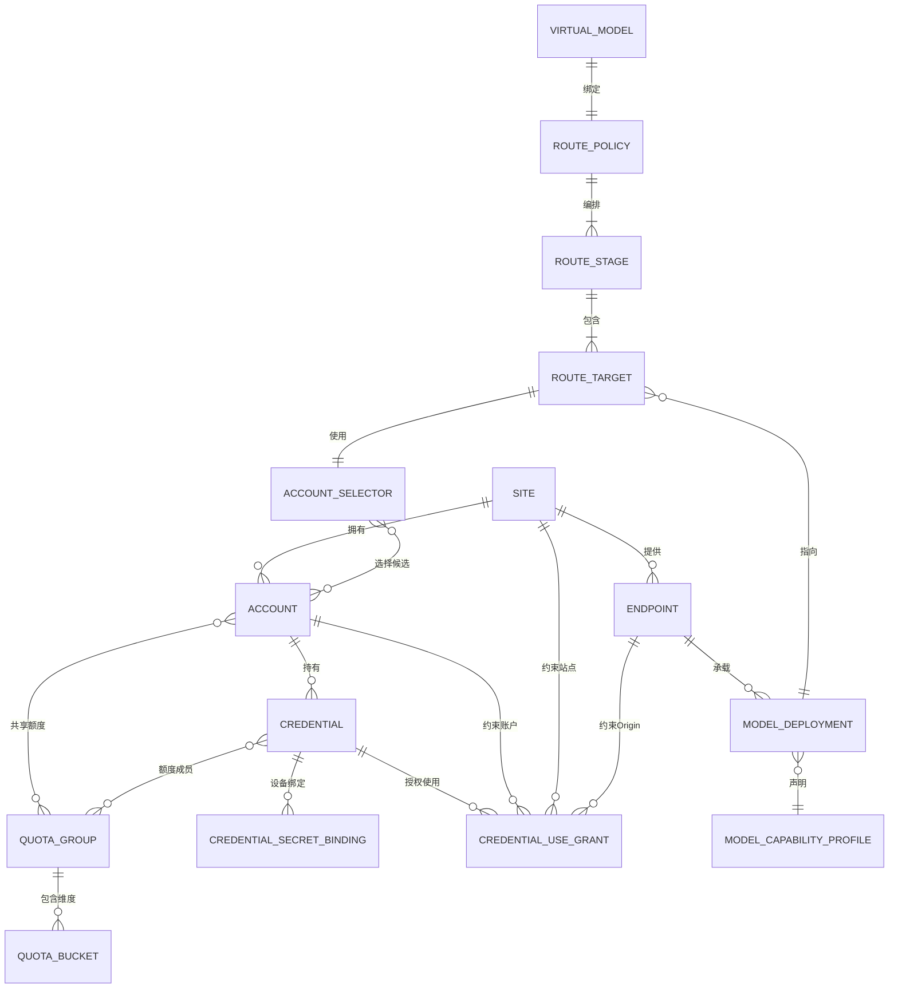
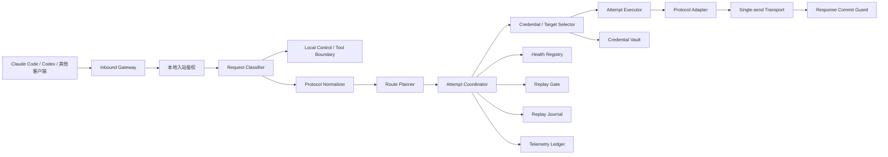
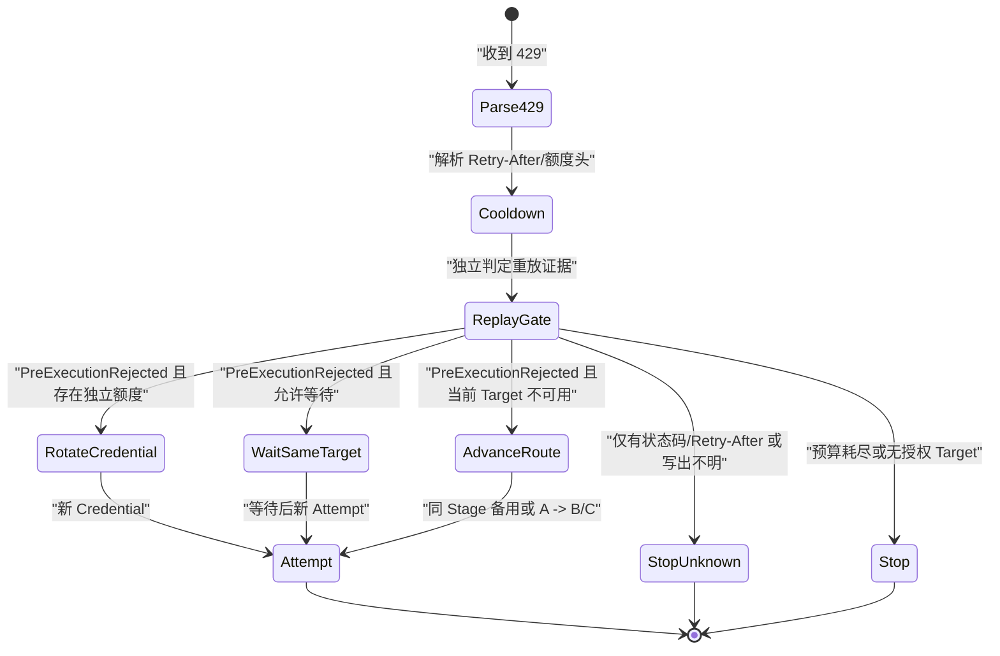

# routing-core v2 架构与迁移规格

- 状态：`Proposed`
- 日期：`2026-08-06`
- 维护身份：`【CodeX-GPT】`
- 适用仓库：`bianma-app`
- 决策：保留 Tauri/React 产品外壳，在公开主仓内重建独立的纯 Rust 路由核心，并用绞杀式迁移替代整仓重写或继续堆叠旧代理分支。

## 1. 摘要

`routing-core v2` 解决的不是“再增加一种负载均衡算法”，而是重新建立站点、账户、凭据、具体模型、路由路径、请求类型、重试语义和安全边界。

核心定义如下：

1. `A`、`B`、`C` 统一表示用户可见的 `RouteStage` 位置标签。普通模式的每个 Stage 只含一个 RouteTarget；每个 Target 必须绑定“站点中的具体模型部署”，不能只指向一个模糊的 Provider。
2. `A -> B -> C` 编译为只允许向后推进的有向无环执行计划；禁止循环、隐式递归和无限重试。
3. 429 不等于站点宕机。它按受信证据影响 Credential、QuotaGroup、Account、ModelDeployment 或 Site；自动换凭据或推进路径前还必须独立通过 ReplayGate。
4. 文件写入、命令执行、解码等工具实际执行留在 Claude Code、Codex 或其他本地客户端；只有真实模型推理及协议明确要求的辅助模型操作才进入上游路由。
5. 一个 `AttemptExecutor` 一次只能产生一次上游发送。请求可能已经写出后，除明确的安全证据外不得自动重放。
6. 两个现有独立代理只作为协议行为、故障案例和回归测试向量，不作为新的生产核心依赖。
7. Credential 只能在显式授权的同一 Site、规范化 Endpoint Origin、Account、Deployment 与认证方案上下文中释放；任何错配都必须在解析 Secret 和调用 Transport 之前失败。

## 2. 当前问题与重建边界

当前公开实现的路由单位仍是 Provider，故障转移仅按队列顺序返回候选。`max_retries` 虽然存在于配置结构中，但不参与主转发执行；错误分类、响应提交、熔断、健康记录和格式转换集中在同一条转发链中。

重建范围：

- 入站鉴权、请求分类和协议入口。
- Site/Endpoint/Account/Credential/ModelDeployment 数据模型。
- 路由计划编译、目标选择、429 与错误动作状态机。
- 单次尝试执行、发送阶段追踪和响应提交边界。
- Credential、QuotaGroup、Account、ModelDeployment、Endpoint 与 Site 分层健康/冷却。
- Secret Vault、JWT 元数据、User-Agent 指纹配置。
- 每次 Attempt 独立、脱敏、可解释的 ReplayJournal 与 TelemetryLedger。

保留范围：

- Tauri/React 桌面壳、托盘、Updater 和页面框架。
- Claude Code、Codex、Gemini 等 CLI 接管与恢复能力。
- 已验证的协议转换器和 Provider adapter，但必须通过新接口接入。
- SQLite 迁移框架和已有非敏感业务数据。

非目标：

- 不把本地桌面代理拆成多个微服务。
- 不引入可执行脚本式路由 DSL。
- 不复用旧多 Key 数组或旧策略链的数据结构与执行语义；其中的 Secret 只能通过受审计迁移器逐项导入新模型。
- 不在代理内执行任意本地工具。
- 不为了“看起来智能”而修改用户的提示词或工具结果正文。

### 2.1 方案对质与裁决

| 方案                                                     | 短期交付 | 三年可维护性 | 迁移/回归风险 | 对现有资产复用 | 裁决                                              |
| -------------------------------------------------------- | -------: | -----------: | ------------: | -------------: | ------------------------------------------------- |
| A：继续在旧 Forwarder、Provider JSON 和独立代理上加分支  |      5/5 |          1/5 |           4/5 |            5/5 | 否决；会继续扩大错误语义、Secret 与协议转换耦合   |
| B：丢弃现有应用并整仓重写                                |      1/5 |          4/5 |           5/5 |            1/5 | 否决；会重复实现成熟 UI、CLI 接管、迁移和发布能力 |
| C：保留应用外壳，独立重写 routing-core，并按协议渐进切流 |      3/5 |          5/5 |           2/5 |            4/5 | 推荐                                              |

评分中 5/5 表示该维度最高；“迁移/回归风险”一列分数越高越差，其余分数越高越好。

最终选择 C：**重写的是路由内核，不是整套产品；复用的是经过验证的外壳和协议资产，不是旧 Forwarder 的控制流。** 新核心通过纯 Rust Port、不可变快照和 Feature Flag 接入，旧核心只在稳定期承担兼容回滚，不再承接新策略。这样既不是继续修补旧“屎山”，也不需要承担整仓推倒重来的迁移风险。

## 3. 强制架构不变量

以下规则必须由类型、配置编译器和测试共同保证：

1. **路由目标具体化**：Target 必须引用一个具体 ModelDeployment。
2. **执行计划不可变**：单个请求开始后固定 `route_snapshot_version`，配置热更新只影响后续请求。
3. **路径无环**：阶段只能保持当前阶段或前进，不能回到前序阶段。
4. **尝试有界**：总次数、单 Target 次数、换凭据次数、等待时间和总 Deadline 均有硬上限。
5. **一次尝试一次发送**：禁止 raw client 失败后在同一个 Attempt 内换 HTTP 客户端重发。
6. **写出不明不重放**：只要无法证明请求未发送或被上游明确拒绝，就不得自动换 Key 或切换 Target。
7. **提交后不重放**：下游响应头或首个有效流事件提交后，不允许切换 Target。
8. **未知路径默认拒绝**：没有明确注册的请求不得透明代理到上游。
9. **本地操作不上游**：本地控制与工具执行不进入 Model Router。
10. **已保存 Secret 不返回 WebView**：已写入 Vault 的 Secret 不得通过 DTO、事件、日志、错误、备份、ReplayJournal 或 TelemetryLedger 返回 WebView；普通录入路径只允许一次性输入 DTO，高保障模式使用原生安全输入组件。
11. **信任等级不静默下降**：请求不得在未授权时从私有/官方站点降级到社区站点。
12. **健康分层**：401、429、5xx 不得统一污染同一个状态；必须分别落到 Credential、QuotaGroup、Account、ModelDeployment、Endpoint 或 Site。
13. **热路径不查数据库**：路由选择使用内存快照；SQLite 负责持久化，不位于每次选择的关键路径。
14. **SecretRef 设备本地化**：跨设备同步逻辑 Credential，不能复用另一设备的 OS keyring/Vault 引用。
15. **激活权限设备本地化**：Active Route、Feature Flag 和公益站 Consent 不得被远端同步或订阅自动开启。
16. **Credential 同站绑定**：任一可执行候选必须满足 Deployment→Endpoint→Site 与 Credential→Account→Site 指向同一 Site；同站只是必要条件，不能代替 Origin 授权。
17. **Credential 精确 Origin 授权**：Secret 只可用于本设备确认的精确规范化 Origin；相同 Site 的其他域名、子域、scheme 或 port 不继承授权。
18. **Secret 解析携带用途**：Vault/SecretResolver 不接受裸 SecretRef；每次解析都必须携带绑定 Snapshot、最终 URL、Deployment、Account、Credential、认证方案与 Attempt 的不可伪造 CredentialUseContext。
19. **最终 URL 先验证、Secret 后解析**：adapter 构造并冻结最终请求 URL 后，AttemptPreparer 必须先验证实际 Origin，再允许读取、解密或注入 Secret。

## 4. 领域模型

| 实体                       | 职责                                                                     | 不负责                         |
| -------------------------- | ------------------------------------------------------------------------ | ------------------------------ |
| `Site`                     | 站点身份、信任等级、隐私和订阅来源                                       | 具体模型与 Secret              |
| `Endpoint`                 | Base URL、协议族、传输能力、端点健康                                     | 用户账户配额                   |
| `Account`                  | 站点账户身份、套餐和所有权                                               | 原始密钥字符串                 |
| `QuotaGroup`               | 以多对多成员关系表达账户或 Key 共享的额度窗口                            | 端点可用性                     |
| `QuotaBucket`              | 某个额度组的 request/token/cost/reset 维度                               | Credential 认证状态            |
| `Credential`               | 逻辑认证身份、认证类型、管理状态和非敏感元数据                           | 设备上的 Secret 引用           |
| `CredentialSecretBinding`  | `(credential, device, slot)` 到本设备 Vault SecretRef 的绑定             | 跨设备同步 OS keyring 引用     |
| `CredentialUseGrant`       | Credential 对同 Site、规范化 Origin、Account 与认证方案的显式使用授权    | 原始 Secret 或任意 Origin 通配 |
| `AccountSelector`          | RouteTarget 内不可变的账户候选、优先级、权重与 CredentialSelectionPolicy | 描述共享额度拓扑               |
| `ModelCapabilityProfile`   | 工具、视觉、流式、Thinking、上下文、JSON Schema 等能力                   | 路由顺序                       |
| `ModelDeployment`          | 一个站点的一个具体上游模型和协议能力                                     | 直接保存 Secret                |
| `RouteTarget`              | ModelDeployment + AccountSelector + UA Profile + 权重/限制               | 任意脚本逻辑                   |
| `VirtualModel`             | 暴露给客户端的稳定模型别名与能力合同                                     | 某个固定站点                   |
| `RoutePolicy`              | 一个 VirtualModel 的阶段、预算和错误动作                                 | 执行 HTTP                      |
| `RouteStage`               | 同一优先层中的一个或多个 Target                                          | 向前序阶段跳转                 |
| `ClientFingerprintProfile` | UA 与协议相关 Header 组合                                                | Authorization 等受保护 Header  |

关系示意：



### 4.1 A、B 的精确定义

用户界面可显示简写：

```text
A:[A.1 = 站点甲 / claude-sonnet-x]
B:[B.1 = 站点乙 / claude-sonnet-x-compatible]
C:[C.1 = 站点丙 / 另一兼容模型 / 明确允许的跨模型备用]
```

`A/B/C` 统一是 RouteStage 的用户可见位置标签，不是数据库主键；稳定主键分别是 `route_stage_id`、`route_target_id` 和 `model_deployment_id`。普通模式中，每个 Stage 恰好包含一个 Target，所以 UI 可以简写为 `A -> B -> C`；ReplayJournal/解释链仍必须同时记录 Stage 标签、Stage ID 和实际 Target ID。

高级模式如果需要同优先级均衡，必须显示为 `A:[A.1 ∥ A.2] -> B:[B.1]`：`A.1`、`A.2` 分别是绑定具体模型部署的 RouteTarget，A 才是包含它们的 RouteStage。禁止把一个模糊的 Provider 或“自动池”伪装成 Target。拖拽改序生成新版本 RoutePolicy，A/B/C 由新顺序派生，Stage/Target/Deployment 的稳定 ID 不变。

同一个 ModelDeployment 可以在不同 RoutePolicy 中被不同 RouteTarget 复用，例如分别绑定“个人账户池”和“团队账户池”；同一份已编译 RoutePlan 内最多只有一个 Target 引用它，由节点内部 Credential Selector 处理账户选择。

## 5. 组件边界



第一阶段采用 Tauri 进程内的纯 Rust workspace crate，例如 `src-tauri/crates/routing-core`。核心不得依赖 Tauri、SQLite、Reqwest/Hyper 的具体实现或 WebView 类型，只依赖由宿主实现的 Port：

```rust
pub trait RoutePlanner {
    /// 根据不可变快照生成本次请求的有界执行计划。
    fn plan(&self, request: &RouteRequest, snapshot: &RoutingSnapshot)
        -> Result<RoutePlan, RouteError>;
}

pub trait AttemptExecutor {
    /// 执行一次且仅一次上游发送，并返回可判定重放安全性的结果。
    async fn execute(&self, attempt: PreparedAttempt) -> AttemptOutcome;
}

pub trait SecretResolver {
    /// 仅为经过四层校验的精确使用上下文短暂解析 Secret；禁止接受裸 SecretRef。
    async fn resolve_for_use(
        &self,
        context: &CredentialUseContext,
    ) -> Result<SecretLease, SecretError>;
}
```

`CredentialUseGrant` 是设备本地的 Origin Consent，至少保存 `device_id`、`site_id`、`endpoint_id`、`canonical_origin`、`endpoint_origin_revision`、`account_id`、`credential_id`、`auth_scheme`、`grant_version`、`pending|approved|stale|revoked` 状态和本机 `user_confirmed` 审批事实；adapter 证据只能辅助展示，不能代替用户授权。Grant 不随 WebDAV/订阅激活，同一 Credential 访问多个 Origin 必须逐个确认。

`RoutingSnapshotBuilder` 从已批准 Grant 编译字段私有的 `CredentialUseAuthorization`，额外绑定 `route_snapshot_version`、`route_target_id`、`account_selector_id`、`model_deployment_id` 与 `adapter_contract_revision`。`AttemptPreparer` 在 adapter 生成最终 URL 后再基于 Authorization 构造一次性的 `CredentialUseContext`，增加 `request_id`、`attempt_id`、重新规范化的 `final_request_origin` 和 one-shot nonce。两种类型都不实现 IPC/Serde `Deserialize`，不能由 Tauri DTO、数据库记录、订阅、导入文件或 adapter 自行构造。

`SecretResolver` 必须根据 Context 内的标识自行查找 Binding 与 SecretRef，调用方无权把任意 SecretRef 与目标 URL 拼接；返回的 `SecretLease` 绑定 attempt/context digest，不可序列化、不可无约束 Clone，`Debug/Display` 脱敏并在释放时清零。

`canonical_origin` 使用固定版本的单一 URL 解析器生成，只包含小写 `http|https` scheme、IDNA ASCII host 与有效端口，默认端口折叠为 HTTP 80/HTTPS 443；禁止 userinfo、path、query、fragment、反斜杠、控制字符、尾点域名、非规范 legacy IPv4 和通配符。Origin 比较使用结构化全等，CNAME、证书相似或字符串前/后缀不能扩大授权；Endpoint 路径不属于 Origin 授权，但仍由 RouteSpec 独立校验。

Endpoint Origin 变更事务必须递增 `endpoint_origin_revision`、把旧 Grant 标为 stale、删除对应 Snapshot Authorization 并要求用户重新确认；禁止把旧 Grant 原地改写到新 Origin。仅 scheme/host 大小写、默认端口表示或 path 变化且 canonical Origin 不变时不要求重确认，但仍生成新快照。Deployment 移动 Endpoint、Credential 移动 Account、Site 归属或 auth scheme 变化同样使 Authorization 失效。已经开始的旧快照只能在原 Deadline 内继续访问其固定旧 Origin，不能跟随配置热更新发送到新 Origin。

## 6. 请求类型与本地工具边界

`RequestClassifier` 依据 HTTP Method、一次规范化后的精确路径模板、客户端协议和请求结构生成显式 `ClassifiedRequest`：

```rust
pub enum RequestKind {
    TransportControl(TransportControlKind),
    LocalAdmin(LocalAdminKind),
    CapabilityQuery(CapabilityQueryKind),
    ModelInference(InferenceKind),
    AuxiliaryInference(AuxiliaryInferenceKind),
    AuthFlow(AuthFlowKind),
}
```

分类器返回 `Result<ClassifiedRequest, RouteReject>`，不定义可以继续执行的 `Unknown` 分支。

| RequestKind                             | 示例                                              | 默认执行位置                               | 是否选择 ModelDeployment |
| --------------------------------------- | ------------------------------------------------- | ------------------------------------------ | ------------------------ |
| `TransportControl::Liveness`            | `/health`                                         | 本地最小 handler，不读取 Secret/路由数据库 | 否                       |
| `LocalAdmin::Status`                    | `/status`、路由解释                               | 经本地 Token/IPC 鉴权的管理面              | 否                       |
| `CapabilityQuery::UnifiedModelCatalog`  | 客户端 `GET /v1/models`                           | 本地 VirtualModel 快照                     | 否                       |
| `CapabilityQuery::DeploymentModelProbe` | UI 探测指定站点模型                               | 只访问指定 Deployment，不走 A→B            | 绑定一个指定部署         |
| `CapabilityQuery::TokenCount`           | Anthropic/Gemini count token                      | 精确本地 tokenizer 或同部署能力端点        | 可能，但使用独立能力计划 |
| `ModelInference::Conversation`          | Messages、Responses、Chat、Gemini generateContent | 上游模型                                   | 是                       |
| `AuxiliaryInference::ContextCompact`    | `/responses/compact`                              | 本地明确实现或支持 Compact 的 Target       | 使用独立辅助路线         |
| `AuxiliaryInference::TraceSummarize`    | 明确登记的记忆摘要路径                            | 支持该操作的 Target                        | 使用独立辅助路线         |
| `AuthFlow`                              | OAuth 登录、Token 刷新                            | 专用认证服务                               | 否                       |

`/health` 与 `/status` 必须分开：Liveness 只返回最少非敏感信息；Status、路由解释和配置属于管理面，必须鉴权。

Token count 必须返回精确度合同：

```text
TokenCountQuality = ExactLocal | ExactUpstream | EstimatedLocal
```

协议要求精确计数时，`EstimatedLocal` 不能伪装成精确结果。计数必须包含 system、工具定义、tool call/result 和多模态开销；远程计数必须绑定请求将使用的同一模型部署。

客户端的 `GET /v1/models` 只从 RoutingSnapshot 合成已授权 VirtualModel。管理面的模型探测必须绑定一个明确 Deployment，结果带 Deployment ID、adapter 版本、时间和 TTL，不能通过故障转移把 B 的模型误记给 A。

### 6.1 RouteSpec 与默认拒绝

ClientProtocolAdapter 必须显式注册操作：

```rust
pub struct RouteSpec {
    pub operation: OperationId,
    pub protocol: IngressProtocol,
    pub method: Method,
    pub path_template: PathTemplate,
    pub query_policy: QueryPolicy,
    pub body_policy: BodyPolicy,
    pub inbound_scope: InboundScope,
    pub kind: RequestKindTemplate,
}
```

分类失败必须发生在 Target 选择、Credential 解析、正文转换、URL 构造和网络连接之前。路径规则：

- 只接受 origin-form path；拒绝 absolute-form、authority、反斜杠、NUL、dot segment、编码后的 `/` 或 `\\` 及重复解码。
- Method、MIME、BodyLimit 和 query 使用每个 Operation 的 allowlist。
- 禁止 `endsWith`/suffix 匹配、任意 wildcard passthrough 和由客户端提供 `x-upstream`/Base URL。
- `/v1/v1` 等兼容路径必须是有遥测和移除版本的显式 alias，不能用字符串循环替换修复任意路径。
- 未知路径返回 404、错误 Method 返回 405、媒体类型错误返回 415、结构或能力不支持返回 422；这些分支上游调用次数必须为 0。

### 6.2 本地工具是带外执行域

必须区分两个容易混淆的概念：

1. **工具执行**：模型提出 tool call 后，文件写入、命令、解码等动作由客户端或本地 MCP/工具运行时执行。它是带外 `ExecutionDomain`，根本不进入模型数据面的 RequestClassifier。
2. **模型上下文中的工具信息**：工具定义、模型生成的 tool call，以及客户端下一轮发送的 `tool_result` 仍属于模型会话协议。代理不能擅自删除，否则会破坏 Agent 状态机；它们只随明确的 ModelInference 请求发送。

工具注册可声明：执行域、模型可见性、结果投影、敏感等级与最大结果尺寸。文件写入通常只需让客户端回传路径、变更摘要或错误，但这属于客户端工具合同，网关不能按工具名猜测并删除正文。

### 6.3 Continuation 与跨部署约束

至少区分：

- `FullHistoryPortable`：请求携带完整历史，tool call/result 能通过无损能力检查后迁移到 B。
- `ProviderStateful`：请求使用 `previous_response_id`、服务端会话、加密 reasoning 或厂商状态，必须绑定原 Endpoint + Account，必要时绑定 Credential。A 失败时默认不能静默切 B。

核心维护不含正文的 `ConversationBinding`：Session Key、Deployment/Endpoint/Account、adapter 版本、continuation mode、call ID 哈希与过期时间。

### 6.4 协议转换完整性

同协议优先原生透传；跨协议先进入类型化 Conversation IR，并返回：

```text
ConversionReport = warnings + losses + unsupported_features
```

默认 `losses` 非空即在发送前返回 422。IR 必须保留内容块顺序、角色、图片、tool call ID/name/arguments、tool result ID/content/`is_error`、reasoning/thinking、缓存元数据和 provider-bound state。禁止用 `_ => {}` 静默丢弃未知块，也禁止递归删除工具 Schema 中所有 `_` 前缀字段。

`/responses/compact` 等辅助推理可能携带完整对话并调用远程模型，不能仅凭“压缩”二字判定为本地工具，也不能失败后降级成普通推理。Compact、TraceSummarize 和 TokenCount 必须拥有不同 Operation、Schema、BodyLimit、超时与能力位。

## 7. 路由策略与路径编译

配置层使用声明式结构，保存时编译并校验，不在请求期间解释任意脚本。示例仅表达合同，不代表最终序列化格式：

```yaml
virtual_model: coding-main
required_capabilities:
  - streaming
  - tools
allowed_trust_tiers:
  - official
  - private
  - community
community_opt_in: true
retry_preset: safe-interactive
stages:
  - stage_id: stage-primary
    label: A
    targets:
      - target_id: target-site-a-sonnet
        deployment: site-a/claude-sonnet-x
        account_selector: site-a-primary
        weight: 100
  - stage_id: stage-secondary
    label: B
    targets:
      - target_id: target-site-b-sonnet
        deployment: site-b/claude-sonnet-x-compatible
        account_selector: site-b-backup
        weight: 100
  - stage_id: stage-tertiary
    label: C
    cross_model: true
    targets:
      - target_id: target-site-c-coding
        deployment: site-c/compatible-coding-model
        account_selector: site-c-community-opt-in
        weight: 50
```

编译门禁：

- Stage ID 必须稳定且唯一，位置 label 在单个 RoutePolicy 版本内唯一，每个 Stage 至少包含一个有稳定 ID 的 Target。
- Target、Deployment、AccountSelector 和 FingerprintProfile 必须存在。
- 每个 AccountSelector 候选都必须满足 `account.site_id == deployment.endpoint.site_id`；Credential 必须属于该 Account，认证方案必须同时受 Deployment、adapter 与站点认证配置支持。
- 每个可激活 Credential 必须存在与 `(credential, account, site, canonical_origin, auth_scheme, endpoint_origin_revision)` 精确匹配且未撤销的 CredentialUseGrant；导入、订阅和 Origin 变更不能自动生成或扩宽 Grant。
- Stage、Target、QuotaSelectionUnit 与 Account 的 effective weight 必须是版本化范围内的正整数；0、负数、NaN/Infinity 或溢出配置拒绝编译，运行时使用确定性定点数算法。
- 只能从当前 Stage 前进到后续 Stage。
- 总尝试预算不得小于必需路径，也不得超过全局安全上限。
- 跨模型 Target 必须显式 `cross_model: true`，并通过 RequiredCapability 校验。
- 跨信任等级必须有用户授权，社区 Target 不能作为隐式默认备用。
- 不支持条件脚本、网络下载代码或自定义认证 Header 表达式。
- 同一 ModelDeployment 在一次执行图中最多出现一次；同部署重试与换凭据是节点内动作，不使用回边表达。
- 初始安全上限建议为 16 个节点、最大深度 8、单节点出度 4；超过上限拒绝激活。

普通模式的线性 Stage 会编译成受限 DAG。高级模式也只能使用稳定枚举边：

```rust
pub enum FailureTransition {
    TransportNotSent,
    ExplicitRateLimit,
    CredentialUnavailable,
    DeploymentUnavailable,
    ExplicitCapacityReject,
    ExplicitCompatibilityReject,
}
```

编译后的 DAG 节点统一是 `route_stage_id`，FailureTransition 边只连接不同 Stage；RouteTarget 和 AccountSelector 的选择属于 Stage 内部状态机，不成为另一套图节点。一个 Stage 内的备用 Target 访问以及同 Target 重试都不通过图回边表达。

同一来源 Stage 的同一种 FailureTransition 最多一条边；所有 Stage 都从唯一入口可达，且至少存在终止 Stage。原始状态码必须先由 adapter 分类，DAG 不消费任意正则、正文关键字或用户脚本。

`ExplicitRateLimit`、`ExplicitCapacityReject` 和 `ExplicitCompatibilityReject` 不是 HTTP 状态码别名；只有 ReplayGate 接受对应的 `PreExecutionRejected` 后，才允许生成这些图转移事件。

### 7.1 Stage 内选择

“轮询还是均衡”的裁决是：默认使用有 Session 粘性的加权均衡，而不是简单 Round Robin；只有用户明确选择兼容模式才启用轮询。

普通路径的每个 Stage 只有一个 Target，直接选择。只有用户显式配置 `A:[A.1 ∥ A.2]` 时，一个 Stage 才包含多个具体 Target；这表示“同优先级均衡”，不改变每个 Target 对具体 ModelDeployment 的绑定。

有多个 Target 时：

1. 过滤协议、模型能力、信任、Site/Deployment/QuotaGroup 冷却、Credential 状态、Endpoint 熔断和并发上限。
2. 有稳定 Session Key 时，先以 stage selector revision/salt 和稳定 Target ID 在 Target 层使用加权 Rendezvous Hash；瞬时 inflight/EWMA 和无关 snapshot 变化不进入 hash。选中 Target 后还必须在 Account/独立额度单元层执行第 7.2 节的稳定选择。只有硬资格集合未变化时才尽力保持 Deployment+Account 亲和，不能承诺 Prompt Cache 必然命中。
3. 无 Session Key 时使用 Power of Two Choices，在候选中比较加权在途请求数与 EWMA 延迟。
4. 首选 Target 出现允许重放的显式失败时，只有 `same_stage_failover` 开启且复合预算允许，才可排除已访问 Target 后选择同 Stage 的另一个 Target；同 Stage 耗尽后再推进下一 Stage。`DeliveryUnknown`、下游已提交或其他禁止重放结果立即停止。
5. Round Robin 只作为高级兼容策略，不作为默认值。

每个 Target 在单个请求内最多访问一次；同 Target 的 429 等待与换 Credential 属于节点内部有界 Attempt，不算再次访问图节点。策略实例与 HealthRegistry 必须在应用生命周期内持续存在，禁止每次请求重新创建计数器。

### 7.2 AccountSelector 与多账户/多 Key

AccountSelector 是 RouteTarget 内嵌的不可变选择合同，决定“哪些 Account/Credential 有资格、优先级和权重是什么”；QuotaGroup 只描述“哪些 Account/Credential 共享同一额度”，二者禁止合并为一个概念。

```rust
pub enum CredentialSelectionPolicy {
    PriorityFailover,
    WeightedLeastInflight,
    RoundRobinCompat,
}
```

首次请求与 429 后重新选择都使用同一合同。`QuotaSelectionUnit` 是当前 selector 中 Account/Credential 与 QuotaGroup 成员关系的连通额度单元；共享同一额度约束的多把 Key 或多个 Account 不得因成员数量增加选择权重：

1. 按 AccountSelector 过滤禁用账户、缺失 Binding、认证类型不兼容、并发上限、Site/Deployment 冷却，以及任一关联 QuotaGroup 不可用的候选。
2. 有稳定 Session Key 时，先按显式优先层过滤，再以 `HMAC(session_affinity_key, session_key)`、`selector_revision`、selector salt 与 `stable_unit_id` 在 `QuotaSelectionUnit` 层执行加权 Rendezvous Hash；随后在单元内对 Account 执行稳定哈希。禁止把全局 snapshot version 作为 hash salt，避免无关配置保存重映射全部 Session；瞬时 inflight/EWMA 也不进入 eligible-set digest。多 Key、多 Account 共享同一额度单元时，总权重由单元配置决定，不能按成员数累加。
3. 无 Session Key 时，默认 `WeightedLeastInflight` 先在独立额度单元之间按配置权重、规范化在途数与 EWMA 延迟选择，再在选中单元内选择 Account 和健康 Credential。`PriorityFailover` 只在当前显式优先层选择；`RoundRobinCompat` 明确关闭 Session 粘性且计数器必须跨请求持久存在。
4. `effective_weight` 编译时限制为正整数，并用固定精度整数计算 `normalized_inflight`，禁止依赖跨平台浮点舍入。Session 命中的单元/Account 只在硬不可用，或受控过载且无法在版本化 `sticky_lease_wait_budget` 内取得 Lease 时允许打破粘性；命中单元能立即取得 Lease 时，不得仅因负载差异切换。硬不可用包括冷却、禁用、缺失 Binding/Grant、认证不兼容和并发硬上限。
5. v1 过载候选门禁要求 `normalized_inflight` 同时大于最小候选的 2 倍且至少高 2，并连续保持至少 2 秒；恢复阈值为不高于最小候选的 1.5 倍或差值不超过 1，并连续保持 2 秒。只有过载门禁成立且 Lease 无法取得或预计等待超过预算时才能选择下一 HRW 排名候选；每个请求最多打破一次。阈值、观察窗与等待预算必须版本化、设上下限并由 HealthRegistry 维护滞回，禁止根据单次 EWMA 抖动随意切换。
6. 打破粘性时，ReplayJournal 必须记录 `session_affinity_broken`、原/新 Unit 与 Account、`cooldown`、`concurrency_limit`、`credential_unavailable`、`lease_wait_budget_exceeded` 或 `overload_threshold` 等枚举原因；RoundRobinCompat 还必须记录 `round_robin_compat_bypassed_stickiness`。只有新候选完整请求成功后才更新 ConversationBinding；备用失败不得永久改绑。Account、Credential 或 Deployment 变化还要记录 `cache_affinity_lost`，不能宣称 Prompt Cache 仍有效。
7. 一个 Credential 属于多个 QuotaGroup 时，Lease 必须原子取得全部关联额度组和账户并发许可；任一失败即释放全部许可。
8. `quota_topology=unknown` 默认按同 Account 或同导入来源共享额度处理，不能假设每把 Key 都有独立配额；只有用户确认或 adapter 提供受信、稳定且不含 Secret 的额度身份后才能拆分。

必须用性质测试覆盖单 Target 下的 Session Account 粘性、多 Target+多 Account 两层稳定选择、同账户多 Key、不同账户共享/独立额度、Key 数量不增权、并发 Lease、受控过载、候选变化和 429 后选择顺序。

### 7.3 面向普通用户的配置体验

内部模型可以严格，但默认 UI 必须保持接近 Clash 的低门槛，不要求用户理解 Credential、QuotaGroup 或 DAG：

1. **添加站点**：用户只填写站点地址、认证信息和可选名称；系统受控探测协议与模型，用户确认精确 Origin 后保存。
2. **选择模型部署**：以“站点 / 模型 / 账户”卡片展示，不再只显示 Provider 名称。
3. **拖拽路径**：用户把卡片排成 `A -> B -> C`；每一层可选“仅一个”或“层内均衡”。
4. **安全预设**：默认启用 `safe-interactive`；429 自动冷却，只有受信的执行前拒绝证据才自动重试，写出不明确错误绝不自动重放。
5. **状态可见**：卡片直接显示可用、429 冷却、凭据失效、端点熔断和信任等级。
6. **一键解释**：预览面板说明当前请求会先走哪个站点模型、失败后为何走下一层。

普通 UI 添加同站点第二个 Key 时，不能把“登录账户”和“额度”合成一个问题，因为不同账户可能共享组织额度，同一账户也可能存在独立 Key 额度。流程分两步，并使用普通语言：

1. “这个 Key 是否属于同一登录账户？”默认“相同或不确定”；据此绑定现有 Account 或创建待确认 Account。
2. “这些 Key 是否共享同一套餐、余额或限流？”默认“共享或不确定”；只有用户明确选择独立，或 adapter 给出受信、稳定的 `quota_identity`，才能拆分 QuotaSelectionUnit。

`account_identity` 与 `quota_identity` 必须分别取证；Key 前缀、用户标签、未验签 JWT 声明和 429 时间相关性都不能作为可信证据。系统分别记录 `account_identity_source` 与 `quota_topology_source=conservative_default|user_confirmed|adapter_verified`，并允许用户以后执行“拆分账户/合并账户”和“拆分额度/合并额度”；变更生成新快照，不追溯改变已开始请求。

高级模式才展开：

- 额度组、权重、并发上限和 Session 粘性。
- 错误动作、重试预算、Deadline 和 429 等待上限。
- 跨模型兼容、社区信任确认和 ClientFingerprintProfile。

导出或订阅的 RoutePolicy 只能包含脱敏引用和声明式配置，不包含 Secret。导入前必须先编译验证并展示目标站点、模型与信任变化。

## 8. Attempt 状态机与发送边界

每次请求由 `AttemptCoordinator` 编排多个独立 Attempt。一次 Attempt 只能绑定一个 RouteTarget、一个 Credential 和一个 Transport 发送。

发送阶段至少包含：

```text
Planned
  -> Connecting
  -> BeforeWrite
  -> WriteStarted
  -> WriteCompleted
  -> ResponseHeadersReceived
  -> FirstSemanticEventReceived
  -> DownstreamCommitted
  -> Completed
```

重放判断必须同时观察两个独立状态轴，不能只看客户端是否已经收到内容：

```rust
pub enum UpstreamWriteState {
    NotStarted,
    ConnectedZeroBytes,
    HeadersPartiallyWritten,
    BodyPartiallyWritten,
    RequestFullyWritten,
    Unknown,
}

pub enum DownstreamCommitState {
    NotCommitted,
    HeadersCommitted,
    BodyCommitted,
    ProtocolTerminalCommitted,
}

pub enum ReplayEvidence {
    NotSent,
    PreExecutionRejected {
        evidence_kind: StableEvidenceKind,
        adapter_version: AdapterVersion,
        contract_revision: ContractRevision,
    },
    DeliveryUnknown,
    IdempotencyGuaranteed {
        contract_revision: ContractRevision,
    },
}
```

`ErrorClass` 只回答“发生了什么”，`ReplayEvidence` 才回答“能否再次发送”，两者必须完全解耦。HTTP status、`Retry-After`、自由文本中的 `overload` 或客户端尚未收到内容，都不能单独生成 `PreExecutionRejected`。该证据只能来自已登记的厂商合同或固定 fixture 验证过的结构化错误码，并携带 adapter/contract 版本；通用 OpenAI-compatible/Anthropic-compatible adapter 默认只能给出 `DeliveryUnknown`。

`AttemptOutcome` 必须携带：

- `send_phase`
- `upstream_write_state`、`bytes_written` 或“无法证明”的 Unknown
- `downstream_commit_state`
- `request_may_have_been_sent`
- `downstream_committed`
- `http_status` 与经过白名单提取的响应头
- `retry_after`
- `error_class`
- `replay_evidence` 与 ReplayGate 生成的 `replay_decision`
- `charge_state = not_charged | charged | charge_unknown`

任何 Transport 都不得在内部静默切换另一个客户端重发。需要 fallback 时，必须返回 Outcome，由 Coordinator 创建新的 Attempt ID。

raw writer 应使用计数写包装器。Reqwest/Hyper 等路径如果无法证明写出为 0，必须保守归类为 `DeliveryUnknown`；字符串错误不能作为零写出证据。客户端主动取消会终止等待/上游连接并按 neutral 记录，不创建下一 Attempt，也不污染站点健康。

## 9. 429 自动重试与故障转移动作

429 使用凭据/额度语义，不使用 Endpoint 宕机语义；但“应冷却谁”和“当前请求能否重放”是两条独立决策。即使 ReplayGate 拒绝重放，RateLimitSignal 仍要更新后续请求使用的冷却状态。

Adapter 必须返回结构化信号，而不是用错误正文宽泛正则猜测：

```text
RateLimitKind  = Transient | Concurrency | QuotaExhausted | Unknown
RateLimitScope = Credential | QuotaGroup | Account | ModelDeployment | Site | Unknown
RateLimitSignal = kind + scope + scope_ref? + bucket_dimension? + retry_at + reset_at_utc
```

`scope_ref` 必须由受信 adapter 元数据映射到已知 Credential、QuotaGroup、Account、Deployment 或 Site，不能接受上游任意字符串作为本地实体 ID。未知 Scope 不能乐观解释成单 Key：当前请求先排除命中的 Credential，以及与它任一已知 QuotaGroup 重叠的其他 Credential；持久状态默认对命中的 Site 设置短时保守冷却，只有 adapter 明确给出更窄 scope 时才缩小到 Credential/QuotaGroup/Account/Deployment。这样宁可暂时走下一站点，也不遍历同站点的账户、Key 和模型形成 429 风暴。



默认算法：

1. 解析 `Retry-After` 的秒数或 HTTP-date，并读取 adapter 明确支持、单位明确的额度 Header/JSON 字段。
2. 先按 Scope 原子更新 Credential/QuotaGroup/Account/Deployment/Site 冷却；Unknown scope 按 Site 短时冷却处理，429 不增加 Endpoint 熔断失败计数。Site scope 命中后过滤该 Site 下所有 Endpoint、Deployment、Account 与 Credential。并发更新使用 `max(现有冷却, 新冷却)`。
3. 统一 ReplayGate 检查 upstream write、downstream commit、ReplayEvidence、Continuation、幂等合同、信任边界和预算。只有 `NotSent`、`PreExecutionRejected` 或经验证的 `IdempotencyGuaranteed` 才能创建附加 Attempt；仅有 429/503、`Retry-After` 或 `RateLimitSignal` 时立即停止当前请求。
4. ReplayGate 通过后，Retry-After 很短、同 Credential 预算尚在且总 Deadline 允许时，等待后同 Credential 最多重试一次，以保持会话粘性。
5. 否则选择同一 Target 中属于**不同可用 QuotaGroup** 的 Credential。多个 Key 共享账户额度时，不得无意义轮换轰炸站点。
6. 没有独立额度时，先按 `same_stage_failover` 和重放安全规则尝试同 Stage 未访问 Target；Stage 耗尽后才推进下一 Stage，例如 A 失败后走 B。
7. 没有 B 时，仅当服务端等待时间仍在请求总等待预算内才继续等待；否则保留完整冷却并向客户端返回结构化 429，绝不能在本地预算到期后提前冲击原站点。
8. 缺少 Retry-After 时使用 Full Jitter 指数退避，并受 `max_retry_delay` 限制；服务端给出明确时间时只能增加正向 jitter，不能随机提前。
9. `QuotaExhausted` 有 reset 时冷却到 reset，无 reset 时进入人工检查状态，不做指数盲重试。
10. 每次真正发送、等待、换 Credential 和推进 Stage 都扣减相应复合预算；允许自动 fallback 前必须先可靠写入 ReplayJournal，非关键指标再进入 TelemetryLedger。

因此，自定义/社区兼容站在没有受信拒绝合同时，首个 429 仍会让该 Credential/额度范围进入冷却，但当前请求不会自动重放；后续新请求会在规划阶段避开已冷却目标。UI 必须明确显示“已冷却；因缺少未执行证据，本次未自动走 B”，不能把安全停止伪装成重试失效。

建议预设：

| 预设                       |             总尝试 | 同 Target 重试 | 429 最大等待 | 写后不明确状态             |
| -------------------------- | -----------------: | -------------: | -----------: | -------------------------- |
| `safe-interactive`（默认） |                  3 |              1 |         2 秒 | 停止，不重放               |
| `resilient-interactive`    |                  4 |              1 |         5 秒 | 停止，不重放               |
| `batch`                    | 按显式预算，上限 5 |              2 |        30 秒 | 停止，除非上游支持幂等合同 |

用户显式配置 `A -> B -> C` 时，总尝试至少覆盖三次首次访问；若还允许同 Target 的 429 等待重试，必须显式增加预算。系统默认不因为池中有十个 Target 就自动尝试十次。

### 9.1 复合请求预算与系统重试预算

一个含义模糊的 `max_retries` 必须拆成：

- `max_total_attempts`
- `max_same_credential_retries`
- `max_credentials_per_deployment`
- `max_deployments_visited`
- `max_total_wait` 与 `max_single_wait`
- `max_compatibility_repairs`
- `absolute_deadline`

本地规划失败、Vault 未解锁和 Credential lease 失败不算上游 Attempt；Transport 一旦开始尝试发送，即使最后是 DeliveryUnknown，也计一次 Attempt。客户端取消立即终止 Backoff 和后续尝试。

单请求上限仍不足以阻止 429 风暴。RoutePolicy、Site、Deployment 和 QuotaGroup 需要额外 Retry Token Bucket：首次请求不消耗 retry token，附加 Attempt 消耗 token；成功请求缓慢补充，bucket 耗尽时仍允许首次请求，但禁止额外重试。新请求优先级高于 Retry，Cooldown/HalfOpen 到期只放行少量 single-flight 探测，避免重试请求饿死正常流量。

## 10. 错误分类、健康影响与重放策略

| 结果                                 | 默认动作                                                               | 健康影响                                      | ReplayEvidence/Decision                   |
| ------------------------------------ | ---------------------------------------------------------------------- | --------------------------------------------- | ----------------------------------------- |
| 配置错误、本地鉴权失败、协议转换失败 | 停止                                                                   | 不影响上游                                    | Forbidden                                 |
| DNS/TCP/TLS 且确认未写出             | 下一 Credential/Target                                                 | Endpoint 失败                                 | Safe                                      |
| 写入中断、等待响应头超时、连接重置   | 停止并标记 `charge_unknown`                                            | Endpoint 异常                                 | Unknown                                   |
| 400/409/422                          | 停止                                                                   | 不影响健康                                    | Forbidden                                 |
| 401                                  | 标记当前 Credential 认证失败；有 `PreExecutionRejected` 才按预算换凭据 | Credential 失效                               | 默认 Unknown；有证据才 ExplicitlyRejected |
| 403                                  | adapter 分类 scope/封禁/策略拒绝；默认停止                             | Credential/Policy                             | 默认 Forbidden                            |
| 404 或 model_not_found               | 更新能力；有 `PreExecutionRejected` 才推进 Stage                       | 更新 Deployment 能力                          | 默认 Unknown；有证据才 ExplicitlyRejected |
| 429                                  | 始终更新分层冷却；有 `PreExecutionRejected` 才等待、换额度组或推进路径 | Credential/QuotaGroup/Account/Deployment/Site | 默认 Unknown；有证据才 ExplicitlyRejected |
| 503/overload/Retry-After             | 更新容量状态；仅受信结构化拒绝证据允许等待或推进                       | Deployment/Endpoint capacity                  | 默认 Unknown；有证据才 ExplicitlyRejected |
| 未知 500/502/503                     | 安全模式默认停止，不写后重放                                           | Endpoint 失败                                 | Unknown                                   |
| 504/524                              | 停止并标记 `charge_unknown`                                            | Endpoint 异常                                 | Unknown                                   |
| 已提交下游响应或首个有效 SSE 事件    | 返回流结果/错误，不再切换                                              | 按最终流结果记录                              | Forbidden                                 |

表中的 ErrorClass、健康影响与 ReplayEvidence/Decision 必须分别计算；禁止从左侧状态码直接推导右侧证据。跨站点不能假定同一个 `Idempotency-Key` 具有共同去重语义。只有上游协议明确提供幂等合同且 adapter 验证成功时，才能把写后重放升级为 Safe。

因此，用户界面的“失败后走 B”必须显示它实际覆盖的失败类型：

```text
默认自动走 B：
  - 确认零写出的网络失败
  - A 的可用凭据全部被带 PreExecutionRejected 证据的 401/429 排除
  - A 以受信结构化证据明确拒绝模型或能力

默认停止并提示可能已执行：
  - 写出后超时、连接重置
  - 504/524
  - 无法证明未执行的 5xx
  - 只有 HTTP 429/503、Retry-After 或通用兼容站错误正文

可用性优先模式：
  - 只能放宽 `NotSent` 或 adapter 明确拒绝结果的等待、凭据切换和部署访问预算
  - `DeliveryUnknown` 仍不得自动推进到 B；UI 可提示“可能已执行/计费”，由用户手动发起一个新的 request_id
```

这样既保留 `A -> B` 的可用性，又不会把“失败”错误地等同于“绝对没有执行”。

## 11. 流式响应提交

`ResponseCommitGuard` 在向下游发送 2xx 响应前，必须完成：

1. 验证上游状态与必要 Header。
2. 在受限缓冲区内等待首个**语义有效事件**，不能把空白、心跳或 SSE 注释当作首个有效事件。
3. 确认事件可由目标客户端协议解析。
4. 一旦提交响应头或有效事件，设置 `downstream_committed = true`，后续禁止重放。

首事件预取必须有严格字节上限和超时，不得缓存完整模型输出。非流式响应同样要在标记成功前完成有界 body 读取与格式校验。

ResponseCommitGuard 只保护下游协议完整性，不提供“请求未执行”的证据。即使首个语义事件尚未提交，只要上游请求已经部分/完整写出，或 2xx 流在首事件前断开，默认仍是 `DeliveryUnknown/charge_unknown`，不能自动换 Key 或走 B；只有 adapter 提供明确拒绝证据或经过验证的幂等合同时才允许重放。

## 12. 分层健康与并发状态

| 层级            | 典型信号                          | 状态示例                               |
| --------------- | --------------------------------- | -------------------------------------- |
| Credential      | 401、已验证 JWT 过期、429、额度头 | active、cooldown、expired、disabled    |
| QuotaGroup      | 共享账户额度耗尽                  | available、cooldown-until              |
| Account         | 封禁、套餐状态                    | active、suspended                      |
| ModelDeployment | model_not_found、能力变化         | healthy、capability-mismatch、disabled |
| Endpoint        | DNS/TLS、5xx、延迟                | closed、open、half-open                |
| Site            | 受信 Site-scope 429、站点级维护   | available、cooldown-until              |

实现要求：

- HealthRegistry 与在途计数在 AppState 生命周期内持久存在。
- HalfOpen 只允许受限探测，不因“只剩一个候选”绕过许可。
- 专用健康探测只使用无敏感内容；禁止拿用户提示词作为跨站探测流量。
- 路由读取无锁或低锁内存快照；健康持久化异步写入 SQLite。
- 冷却同时保存墙钟截止时间与内存单调时间语义，应用重启后采用保守恢复。
- SiteRateLimitState 和 Site Retry Token Bucket 保持设备本地；Site scope 命中后，该 Site 下所有 Endpoint、Deployment、Account 与 Credential 都从候选中排除，到期只放行 single-flight 探测。
- 成功定义为完整响应成功，而不是仅收到 2xx Header。
- Credential 选择通过原子 Lease：Site、Account 和所有关联 QuotaGroup 可用且并发许可成功后才增加 in-flight；成功、失败、取消都必须释放。
- 同一 QuotaGroup 下的 Key 数量不能隐式增加调度权重；公益站另有全局并发和速率上限。
- 运行时健康、EWMA 和冷却带 Device ID/TTL，不通过 WebDAV 同步；过期健康只是弱信号，不能永久熔断。
- in-flight 不持久化为裸计数器，由未终止 Attempt/租约重建并回收过期租约。

## 13. Secret、Bearer 与 JWT

Secret 目标态：

- 可同步的逻辑 Credential 只保存认证类型、管理状态和非敏感元数据；设备本地 `CredentialSecretBinding` 才保存 opaque `secret_ref`。
- 设备 root key 由 Windows DPAPI/Credential Manager、macOS Keychain 或 Linux Secret Service/用户口令保护；实际 Secret 使用版本化数据密钥和 AEAD 存入本地加密 Vault，避免受 OS keyring 单条容量限制。
- `SecretGuard` 不实现 `Serialize`、会暴露内容的 `Debug`、`Display` 或无约束 `Clone`，Drop 时清零内存。
- RoutePlanner 永远拿不到原始 Secret；WebView 永远拿不到已保存的原始 Secret，普通录入时的残余边界见第 18.1 节。
- Secret 仅由 AttemptExecutor 在发送前解析，并在最短生命周期内持有。
- routing-core v2 的表在新版 E2EE 逻辑快照完成前全部排除现有 WebDAV SQL；路由元数据本身可决定提示词流向，也需要认证与防篡改。
- 跨设备只同步逻辑 Credential；目标设备默认显示 Secret missing。Secret opt-in 同步必须使用独立 recovery key/E2EE，不能同步 OS keyring 的 SecretRef。

Vault 锁定、损坏或本设备 Binding 缺失时必须 fail closed，禁止静默回退到 Provider JSON。具体 keyring/AEAD crate、三平台锁定与打包行为必须先做 PoC、许可证和安全公告审计，不能在架构阶段假设依赖已经可用。

Credential 释放采用四层纵深门禁，任一层失败都返回稳定的非敏感错误码：

1. **RoutePolicyCompiler**：验证 Target 的 Deployment→Endpoint→Site 与 Account→Credential→Grant 同站，认证方案兼容，Origin Grant 精确匹配且未撤销；结构性错配最多保存为不可激活 Draft，不能发布执行计划。
2. **RoutingSnapshotBuilder**：不信任历史编译结果，从持久化实体重新计算 canonical Origin 与 `endpoint_origin_revision`；数据库损坏、悬空关系、过期 Grant 或任一异常候选都使整个新 Snapshot 拒绝发布，禁止静默丢弃异常 Credential 后继续。
3. **AttemptPreparer**：在选定 Account/Credential 且 adapter 构造最终 URL 后，冻结 URL 并重新规范化实际 Origin，再从当前快照内部构造 `CredentialUseContext`，核对 snapshot version、Deployment、Account、Credential、Origin、auth scheme 与 adapter contract；上下文不匹配时不得调用 SecretResolver，后续 Header/Profile 也不得改变 URL、Host 或 TLS authority。
4. **Vault/SecretResolver**：只接受 `resolve_for_use(context)`，在读取或解密 Vault 之前根据 context 独立查找并校验本机 Binding、Grant version、Origin revision、设备、slot 和撤销状态；禁止提供 `resolve(secret_ref)` 逃生口。解析失败时不得构造 PreparedAttempt，更不得调用 Transport。

CredentialUseGrant 只允许精确 Origin，不支持 `*.example.com`、路径前缀或“同 Site 自动继承”。修改 Endpoint 的 scheme、host 或有效端口时，保存事务先撤销/失效旧 Origin revision，再把新 Endpoint 标为 `credential_confirmation_required`；用户确认新 Origin 前，编译和快照激活均失败。稳定错误枚举至少包括 `cross_site_credential_binding`、`origin_grant_missing`、`origin_grant_stale`、`endpoint_origin_mismatch`、`auth_scheme_mismatch`、`snapshot_authorization_mismatch` 与 `credential_use_not_authorized`，且不得回显 URL 中敏感 query 或任何 Secret。

集成测试必须覆盖导入错绑、数据库外键损坏、跨 Site Account、跨 Origin Endpoint、adapter 最终 URL 偏离、错误 auth scheme 和 stale snapshot：在这些流水线错配路径中，SecretResolver mock 与 Transport mock 的调用次数都必须为 0。直接调用 Resolver 的纵深单元测试中 Resolver API 调用自然为 1，但必须断言 VaultBackend read/decrypt 与 Transport 均为 0；正常精确匹配路径则 Resolver 与 Transport 都恰好调用 1 次。

所有 API Key、Bearer 和 OAuth Token 保存后统一自动屏蔽，不提供“长期明文显示”开关。`CredentialSummary` 只返回用户标签、认证类型、状态、更新时间和设备本地指纹：

```text
cred:v1:<Base32(HMAC-SHA256(K_fingerprint, canonical_secret))[0..16]>
```

指纹使用从设备 Vault 根材料独立派生、带版本的 `K_fingerprint`，不能使用裸 SHA-256；这样可以在本设备识别重复输入，又不能被远端日志用于跨设备关联。`canonical_secret` 使用第 18.1 节类型化校验后的精确字节；Bearer 只移除单个 scheme，不做大小写转换或 Unicode 归一化。普通 API Key 不显示前缀、尾号或长度，避免站点格式和部分 Secret 泄露；需要区分多 Key 时使用用户自定义标签和上述指纹。设备本地指纹不得写入 WebDAV metadata 或 secret payload。

Bearer 输入与 JWT 元数据规范：

1. 保存时只拆分一个大小写不敏感的可选 `Bearer` scheme，拒绝 CR/LF/NUL、空 Token 和重复 scheme，避免生成 `Bearer Bearer ...`。
2. 三段 Base64URL 结构只在 compact token 总长不超过 16 KiB、解码 Header 不超过 4 KiB、Payload 不超过 8 KiB、JSON 深度不超过 16、全部对象成员不超过 256、单个字符串不超过 4 KiB 时解析；超限即停止元数据解析。Header/Payload 的所有嵌套对象都使用拒绝重复 key 的解析器，但这不证明签名有效，也不自动访问 `iss` 指向的网络地址。
3. `iat`、`nbf`、`exp` 遵循 RFC 7519 NumericDate：单位固定为 Unix epoch 秒，只接受有限 JSON number，不接受数字字符串。允许小数秒，但必须用 checked decimal/fixed-point 解析到最多纳秒，禁止经 `f64` 转换；UI 显示毫秒时向下截断，绝不因四舍五入延长 `exp`。支持范围限定为 `0..=253402300799`，超范围不参与时间计算。
4. 若同时存在，检查 `exp >= iat`、`exp >= nbf`；`exp == nbf` 作为零有效窗口警告。未验签状态下，未来 `iat/nbf`、已过 `exp` 与时钟回拨只使用设备默认或已注册 Site 的展示 skew policy，默认 60 秒、硬上限 5 分钟，绝不能根据未验签 `iss` 选择策略；签名、issuer/audience 验证成功后才可使用受信 issuer policy。
5. `iss` 只接受不超过 256 UTF-8 字节的 JSON string；UI 使用纯文本转义渲染，不自动链接、导航或发网络请求，控制字符、Bidi 控制符和异常长度只显示安全占位与警告。UI 显示 Credential 指纹、可选安全渲染的 `iss`、`iat`（签发）、`nbf`（生效）、`exp`（过期）、当前 UTC、剩余时间、状态和醒目的 `claims_unverified`；不显示完整 Header/Payload、`sub` 或 email。
6. 非 JWT Bearer 作为 opaque token 正常支持；解析失败不把原文写入错误或日志。所有未验签字段、关系异常、时钟警告和剩余时间都只能形成可逆 UI hint，不能持久禁用 Credential、写入冷却或改变 eligibility；硬过滤仍要求受信 issuer/JWK 或 adapter 完成签名、issuer/audience 与时间验证。
7. 保存后默认只允许替换，复制能力默认关闭。用户显式启用时，必须先警告系统剪贴板历史、云同步、远程桌面和其他进程读取风险，再由 Rust 在应用聚焦、二次确认和本地授权通过后直接写系统剪贴板；命令只返回成功/失败，不能先把 Secret 返回 WebView。
8. 复制使用不超过 30 秒的短 TTL；到期后仅当当前剪贴板内容的本地 HMAC 仍等于本次 Credential 指纹时才清空，绝不能覆盖用户后来复制的新内容。审计只记录 Credential ID、时间、动作结果和清理结果，不记录 Secret。

因此“自动屏蔽还是允许查看”的裁决是：**自动屏蔽属于不可关闭的安全不变量；受控复制是默认关闭的显式高风险操作，不等同于在 UI 中揭示原文。** TTL 清理无法删除操作系统已保存的剪贴板历史或云端副本，产品文案禁止称为“安全复制”。

JWT 每段都有大小上限。只有 Credential 显式声明为 JWT，且经受信 issuer/JWK 或站点 adapter 完成签名、issuer/audience 与时间校验后，`nbf/exp` 才能成为硬过滤条件。未验签的 `iss/iat/nbf/exp` 只用于 UI hint，不得改变路由 eligibility；真正失效由验证结果或带受信拒绝证据的 401 驱动。缺少 `exp` 不能武断判无效。系统时钟异常需显示 clock warning，并对展示剩余时间和 Cooldown 做保守夹断。

### 13.1 CLI 凭据物化策略

Vault 只保护 Bianma 内部数据；如果仍把上游 Key 写入 Claude/Codex 配置文件，就不能宣称端到端完成 Secret 保护。必须显式区分：

1. `proxy_only`（默认）：CLI 只获得 loopback 地址和随机本地 ingress token，上游 Secret 永远留在 Bianma Rust/Vault。
2. `process_env`（后续验证）：由 Bianma 启动 CLI 并以短生命周期环境变量注入，仍需评估系统进程读取风险。
3. `direct_config`（兼容模式）：明确警告会把上游 Secret 写入外部配置文件；记录只含目标路径哈希和 Credential ID 的本地物化账本，并提供清理/替换。

各 CLI 是否支持安全的 process env 必须按版本实测。启用代理接管时，应把直连 Secret 替换成本地 ingress token；异常退出恢复由物化账本驱动，不能把 Secret 写进错误或日志。

## 14. ClientFingerprintProfile 与 User-Agent

UA 不是单个自由文本字段，而是版本化协议指纹：

- `passthrough`
- `claude-cli`
- `claude-desktop-3p-agent-sdk`
- `codex-cli`
- `custom`

版本化预设可以生成用户提到的精确形态，例如：

```text
claude-cli/2.1.161 (external, cli)
claude-cli/2.1.219 (external, claude-desktop-3p, agent-sdk/0.3.219)
```

版本号、产品标记和 agent-sdk 版本必须是 Profile 的类型化字段，不散落硬编码在 adapter 中。`custom` 允许用户提供受长度和字符集限制的 User-Agent，并在发送前预览最终值；站点订阅只能推荐 Profile，不能静默覆盖用户选择。UA 只用于协议兼容，不能被当成认证或绕过站点权限/条款的手段。

Profile 可管理 `User-Agent`、`x-stainless-*`、`originator`、`x-app` 等协议相关 Header，并记录适用的客户端协议和版本。自定义 Header 必须经过 allowlist；禁止覆盖：

- `Authorization`
- `Proxy-Authorization`
- `Host`
- `Content-Length`
- `Transfer-Encoding`
- `Connection` 及其他 hop-by-hop Header

健康检查、模型发现和真实推理必须通过同一个 Profile Builder 生成指纹，避免测试可用而真实请求因指纹不同失败。

日志只记录 Profile ID 与版本，不记录完整自定义 UA。应用顺序固定为：生成安全 Header → 应用 UA Profile allowlist → 清除受保护/逐跳 Header → 最后注入站点认证；任何自定义值均拒绝 CR/LF/NUL 并限制总大小。

## 15. 公益站与信任边界

建议的 TrustTier：

- `official`
- `private`
- `community`

默认策略：

- 用户私有代码、提示词和工具结果不得从 official/private 静默降级到 community。
- 第一次把社区站点加入 RoutePolicy 时必须显示信任确认。
- 订阅源只能提供声明式 Site/Endpoint/Model 元数据，不能携带可执行脚本、任意认证 Header 或本地文件路径。
- 订阅必须支持签名验证、版本固定、回滚和 SSRF 防护。
- 健康可用不等于可信；TrustFilter 必须在 HealthFilter 之前执行。

Endpoint 默认只允许 HTTPS 且禁止 userinfo/fragment。用户自建本地服务可显式允许 loopback/private IP，但签名目录和公益站订阅不得携带这类地址。每次 DNS 解析和重定向都重新校验 IP，禁止 link-local、云元数据和非 HTTP(S) scheme。跨 Origin 重定向默认终止当前 Attempt，不能仅移除认证 Header 后自动跟随；如受审 adapter 确需访问新 Origin，必须先取得该精确 Origin 的独立 Grant，并由 Coordinator 在 ReplayGate 与预算允许时创建新的 Attempt，原 SecretLease 绝不能复用。

“自动选择当前能用的公益站”只能发生在用户已经授权的 community RouteStage 内，而不是把任意网络订阅自动并入默认路径。

### 15.1 WebDAV 与跨设备边界

现有明文 SQL + 裸 SHA-256 manifest 不能承载 v2：攻击者可同时替换数据库和 manifest，把路径重定向到恶意站点。新版同步必须使用版本化逻辑快照和独立 `K_sync_root`：

```text
manifest.json        # 协议、KDF、密文大小和传输 hash
metadata.enc         # Site/Endpoint/Account/Deployment/RouteGraph
vault-secrets.enc    # 可选，用户显式启用
tombstones.enc       # 删除和冲突事实
```

Payload 使用 AEAD，包含 snapshot sequence/hash chain 防回放；上传使用 ETag/If-Match，服务端不支持条件写时进入显式冲突处理。Active Route、Feature Flag、CredentialUseGrant、运行时健康、ReplayJournal、TelemetryLedger 和公益站 Consent 均保持设备本地，不随元数据同步。OS keyring SecretRef 永不跨设备复用；远端 Endpoint 到达本设备后必须重新确认精确 Origin 才能激活关联 Credential。

同步冲突标识与本地展示指纹严格分离：

- metadata-only 同步只用逻辑 `credential_id`、独立 `metadata_revision/parent_metadata_revision`、墓碑和快照序列判断并发冲突；远端 Credential 在本机没有 Binding 时保持 `secret_missing`，不得用设备指纹猜测相等或覆盖本地 Secret。`metadata_revision` 与 `secret_revision` 禁止合并成一个 credential version。
- 用户显式启用 Secret E2EE 后，`vault-secrets.enc` 的 AEAD 明文内部保存独立 `secret_revision/parent_secret_revision` 与 sync commitment。Commitment key 固定为 `HKDF-SHA256(K_sync_root, salt=sync_id, info="bianma/routing-v2/credential-commitment/v1")`；消息使用无歧义 `LP(credential_id) || LP(auth_scheme_version) || LP(canonicalization_version) || LP(canonical_secret)`，其中 `LP` 是 `u32` 大端字节长度前缀加原字节。commitment 只在解密后比较，不进入 manifest、metadata、日志或 UI。
- `K_fingerprint`、`cred:v1:*` 和任何设备派生标识禁止上传。同步冲突默认保留双方版本并要求用户选择，不能自动 last-write-wins。

## 16. Protocol Adapter 合同

Adapter 拆成三层，均不负责全局循环或持久状态：

- `ClientProtocolAdapter`：注册 RouteSpec，解析/校验客户端 Envelope，编码客户端响应与协议错误。
- `UpstreamProtocolAdapter`：声明 Operation/Capability，使用 adapter-owned 路径模板构造 URL，编码请求、解析响应/SSE、分类 401/403/404/429/5xx，并返回 ReplayEvidence 与 ConversionReport。
- `AttemptPreparer`：在 Target、Account 与 Credential 已确定后，让 Upstream adapter 先用注册模板构造并冻结不含认证材料的最终 URL；重新规范化实际 Origin 并与不可变快照的 Authorization 全等后，才构造 `CredentialUseContext`、调用 `resolve_for_use`、应用 ClientFingerprintProfile、清理受保护/逐跳 Header，并在最后注入认证，生成一次发送的 PreparedAttempt。Context、Grant、最终 URL、Host 或 TLS authority 错配时必须在解析 Secret 前停止。

Compact、TraceSummarize、TokenCount、ModelProbe、vision、tools、thinking 等必须分别声明能力。Adapter 能提供分类和证据，但不能自行决定重发、切 B 或修改全局健康。只有经过评审的站点合同注册表才能允许 adapter 生成 `PreExecutionRejected`；注册项必须固定结构化错误码、adapter 版本、contract revision 与脱敏 fixture。通用兼容 adapter、状态码、Retry-After 和自由文本均无权生成该证据。

`claude-porxy` 中的限流分类和 Retry-After 行为、`codex-freemodel-proxy` 中的 SSE 终止、半截 JSON、有界解压、逐跳 Header 清理及零写出重试应转换为 adapter/transport 回归测试，不运行其 JavaScript 作为生产子进程。

## 17. ReplayJournal 与 TelemetryLedger

账本拆成两个不同可靠性等级，禁止用一个“异步但不能丢”的模糊队列同时承担安全和指标职责。

同步、fail-closed 的 `ReplayJournal` 每次 Attempt 最少记录：

- request/attempt/route plan ID
- route snapshot version
- RequestKind 与 VirtualModel
- Stage 标签/ID、Target、Deployment、Site
- Credential 指纹，不记录 Secret
- 选择原因、过滤原因和 fallback 原因
- send phase、write/commit state、ReplayEvidence、ReplayDecision、charge state
- 下一动作与动作预算扣减
- 开始、终止和中断时间

异步、有界且允许降级的 `TelemetryLedger` 记录：

- HTTP 状态、结构化错误码、Retry-After
- connect/TLS/TTFB/首语义事件/总耗时
- 输入输出字节数和 token 计数（如果协议可靠提供）

禁止记录：

- Authorization、Cookie、JWT、API Key
- 完整 URL userinfo 或敏感 query
- 提示词、源码、请求/响应正文、SSE payload、工具正文

Session ID 如需用于粘性关联，只保存带轮换本地 Key 的 HMAC 别名并设置保留期。应用重启后，所有未终止 Attempt 标记为 `interrupted`；只要可能已写出就保持 `charge_unknown`，绝不自动恢复发送。

每次上游发送前都必须先在 ReplayJournal 提交 Attempt intent；任何同 Key 重试、换 Credential、同 Stage 备用或跨 Stage fallback 还必须同时提交上一 Attempt 的关键结果和下一动作。磁盘满、SQLite 锁超时或 journal 写失败时不创建该次发送：首次 Attempt 返回 `replay_journal_unavailable`，附加 Attempt 则停止自动重放并保留原错误。同步等待只发生在发送前的有界门禁，不得夹在已经提交的模型流中；TelemetryLedger 仍使用有界异步队列，队列满时丢弃非关键指标并增加 drop counter。两类记录分别设置保留期，清理不得阻塞模型流。

UI 应提供“为什么选择 B”解释链，例如：

```text
A:[A.1=site-a/claude-sonnet-x]
  -> Credential cred-a-primary 命中 429，QuotaGroup 冷却到 12:30:05
  -> adapter v3/contract r7 给出 PreExecutionRejected，ReplayGate 通过
  -> A.1 无其他独立额度组
  -> 按 route policy 推进到 B
B:[B.1=site-b/claude-sonnet-x-compatible]
  -> 能力、信任和健康校验通过
  -> 请求成功
```

## 18. 配置快照与持久化

建议采用：

- SQLite 保存规范化实体和版本号。
- `RoutingSnapshotBuilder` 在配置保存/启动时重新计算 canonical Origin，校验 Site/Account/Credential/Grant/auth scheme 与 origin revision，并生成不可变快照。
- AppState 原子替换 `Arc<RoutingSnapshot>`；请求固定使用开始时的快照。
- HealthRegistry 单独维护高频运行态，不因配置快照替换丢失。
- 配置写入使用事务，路由编译失败则整次保存失败，不留下半配置。

不建议让每个请求现查 SQLite，也不建议第一阶段引入 Redis、独立守护进程或远程配置中心。当前是本地桌面控制面，进程内模块化单体能提供更低的运维成本；纯 Rust Port 边界保留了未来抽取独立进程的可能性。

### 18.1 应用服务与前端 DTO

Tauri Command 只调用应用服务，不直接操作 routing-core 内部表。建议的命令边界：

- Site/Endpoint/Account/ModelDeployment 的查询与受校验更新。
- `begin_secret_submission`：返回短时、单次使用的 `SecretSubmissionPermit`；`create_credential(permit, SecretInputDto)` 与 `replace_credential_secret(permit, SecretInputDto)` 只有原子消费 Permit 后才能按认证方案校验并写入 Vault，只返回 `CredentialSummary` 或不含输入值的稳定错误码。
- `compile_route_policy`：保存前编译并返回错误、警告和脱敏预览。
- `preview_route_decision`：使用合成请求查看 A/B/C 选择，不发送上游请求。
- `get_route_explanation`：按 request ID 返回脱敏选择链与 Attempt 摘要。
- `reset_credential_cooldown` 与 `probe_endpoint`：必须是显式管理动作，不伪装成真实用户请求。

前端只使用 Summary/ViewModel：`SiteSummary`、`CredentialSummary`、`ModelDeploymentSummary`、`RoutePolicyView`、`AttemptSummary`。这些类型不得复用包含 Secret 的后端领域结构。

普通 WebView 录入无法让 Secret “从未进入 JavaScript”，因此边界必须写实：**已保存 Secret 永不返回 WebView**。`SecretInputDto` 是独立于持久领域对象的一次性枚举，不实现 `Clone`/`Debug`，至少包含 `ApiKeyInput`、`BearerTokenInput`、仅用于手工导入的 `OAuthAccessTokenInput`、`BasicAuthInput` 与受注册 schema 约束的 `CustomAuthInput`。前端使用非受控 password input，只在用户提交瞬间读取；禁止进入 React/TanStack reactive store、localStorage/sessionStorage、URL、表单草稿、遥测、错误上下文、崩溃报告或 Tauri Event。`autocomplete="new-password"`、关闭 spellcheck/autocorrect 只能作为 WebView 提示，不能承诺 OS/WebView 不缓存；验收只证明应用自身不持久化或回显。提交完成后立即清空 DOM 字段并丢弃引用，但必须明确 JavaScript immutable string 和 WebView/OS 内存无法可靠原地清零；高保障模式应提供原生安全输入组件，让原始 Secret 直接进入 Rust/Vault。

`SecretSubmissionPermit` 至少绑定 128-bit CSPRNG nonce、WebView `window_id`、`site_id`、`account_id`、`credential_id`（替换时）、`auth_scheme`、`expected_version` 与不超过 120 秒的 `expires_at`。Permit 保存在 Rust 的有界单次消费表中，窗口关闭、超时、上下文/version 不匹配或重复提交都失败；消费、Vault 写入、Binding/metadata 更新必须由 Secret Saga 保证原子可恢复，校验或写入失败时旧 Secret 与 Binding 保持不变。Tauri invoke 参数捕获、serde 错误、tracing span、panic/catch middleware 和 command 返回包装必须对整个 Secret command 强制脱敏，不能依赖每个调用点自行记得关闭日志。

正常 OAuth Authorization Code/PKCE、device flow 与 Token Exchange 必须由 Rust 应用服务通过系统浏览器/loopback 或设备码边界完成，access/refresh token 不经过 WebView；`OAuthAccessTokenInput` 只用于用户明确选择并收到风险提示的手工 Token 导入。

写 Vault 前必须执行类型化、确定性的认证输入校验，发送阶段不能成为第一次发现 Header 无效的地方：

1. v1 合同将整个 Secret IPC payload 硬限制为 16 KiB，单字段上限由 adapter/auth profile 进一步收紧；运行时配置不得放宽全局上限，超限必须在复制、日志或格式化前拒绝。
2. `ApiKeyInput`、`BearerTokenInput` 与 `OAuthAccessTokenInput` 拒绝空值、CR/LF/NUL、C0/DEL 控制字符和不满足 `http::HeaderValue::from_bytes` 的字节；默认拒绝首尾 ASCII 空白而不是静默 trim。Bearer 只移除一个大小写不敏感的可选 scheme，OAuth 是否使用 Bearer 由注册的 auth profile 决定。
3. `BasicAuthInput` 分离 username/password；两字段都拒绝 CR/LF/NUL 与 C0/DEL，username 额外禁止冒号，编码与 charset 必须由站点注册 profile 明确，保留允许的普通空白而不静默 trim，不把拼接前原文写入普通表；`username:password` 编码和最终 Authorization Header 都要经过长度与 HeaderValue 校验。
4. `CustomAuthInput` 只能引用经过代码评审、版本固定的 adapter auth schema，逐字段声明 secret/non-secret、编码、长度、空白和允许的注入位置；用户不能指定任意 Header 表达式、模板代码或覆盖 Authorization/Proxy-Authorization/Host 等受保护 Header，但固定 auth profile 可以拥有唯一、类型化的 Authorization 注入权，且仍在 UA/Profile 处理后最后执行。
5. 校验错误只返回 `credential_input_empty`、`credential_input_too_large`、`credential_input_control_char`、`credential_input_invalid_header`、`credential_input_invalid_encoding`、`credential_input_schema_mismatch` 等枚举码与字段类别，不回显原 Secret、长度细节、前后缀或序列化 DTO。

### 18.2 代码所有权与依赖方向

```text
src-tauri/crates/routing-core/
├─ domain/          # Site/Account/Credential/Quota/Deployment/Health
├─ classifier/      # RouteSpec、RequestKind、路径与请求校验
├─ planner/         # RouteGraph 编译、快照、Target 选择
├─ attempts/        # Budget、ReplayGate、Coordinator、ReplayJournal/Telemetry Port
├─ protocol/        # 类型化 IR、Capability、ConversionReport 接口
├─ policy/          # trust、Header、URL、UA 与 RetryPolicy
└─ ports/           # Clock、Random、SecretResolver、Transport、Store trait

src-tauri/src/routing_v2/
├─ vault_adapter/       # OS root key + encrypted vault
├─ routing_store/       # SQLite repository/migration Saga
├─ transport_adapter/   # HTTP/SSE 与写出状态凭证
├─ protocol_adapters/   # Claude/Codex/Gemini 双侧 adapter
├─ sync_adapter/        # WebDAV E2EE 逻辑快照
└─ tauri_dto/           # 脱敏应用服务与前端 DTO
```

依赖只能从宿主 adapter 指向 routing-core Port。Planner 只接收 CredentialAvailability 摘要，不能解析 Secret；Protocol Adapter 不能操作数据库或决定全局重试；Transport 不得内置 Target fallback；UI/Command 不得直接访问 repository。用这些编译期边界替代“大家约定不要再写进 forwarder.rs”。

## 19. 渐进迁移计划

### Phase 0：安全止血与 v1 冻结

- 加入本地入站 Token、loopback 默认监听、严格 CORS 和合理 body 限制。
- 全面禁止正文/Secret/panic 日志，修正 Deep Link、URL 和错误持久化脱敏。
- 将 `get_providers` 等 IPC 改为脱敏 DTO，移除向 WebView 返回原始 Copilot Token 的命令。
- WebDAV password 和 Copilot/API Secret 进入临时 Vault 边界；v2 表与遗留 Provider Secret 暂停进入远端 SQL。
- 修复同 Attempt 双发送问题。
- v1 只接受安全和致命回归修复，不再新增策略能力。

### Phase 1：核心骨架与合同

- 新建纯 Rust `routing-core` crate。
- 建立领域类型、Port、RequestKind、ErrorClass、SendPhase、ReplayEvidence 与 ReplayGate。
- 将两个独立代理的协议故障样例转为测试向量。

### Phase 2：Vault 与规范化数据模型

- Additive 新增 Site/Endpoint/Account/QuotaGroup/QuotaBucket/Credential/CredentialSecretBinding/CredentialUseGrant/ModelDeployment 与 migration journal。
- 实现 Secret Vault、设备本地 Binding 和脱敏 DTO。
- 旧 Provider 只读迁移到新实体；旧字段暂不删除。
- Phase 2 的 Secret Saga 只推进到 `discovered -> vault_written -> vault_verified -> metadata_committed`；`execution_verified` 必须等待当前可回滚 executor 的真实认证成功，`legacy_scrub_pending -> scrubbed` 只允许在 Phase 6 的全部回滚门禁通过后推进。加密备份失败必须 fail closed。

### Phase 3：路由编译与 Shadow Decision

- 实现 RoutePolicy 编译、DAG 校验、Target/凭据选择和 HealthRegistry。
- v1 继续发送真实请求；v2 只计算选择结果并比较，不解析 Vault Secret、不占用真实配额、不复制模型请求。
- 记录选择差异，不记录正文。

### Phase 4：Claude 切流

- Claude adapter 首先接入 AttemptExecutor 和 ResponseCommitGuard。
- Feature Flag 支持按用户/RoutePolicy 回退 v1。
- 完成 429、多账户、多 Key、A -> B 路径真实集成测试。
- Credential 只有经 SecretResolver 被当前可回滚 executor 成功认证后才能进入 `execution_verified`；没有无计费鉴权端点时，必须等待一次真实成功请求或用户显式验证，不能用“Vault 可读”代替上游认证。

### Phase 5：Codex、Gemini 与辅助操作

- 接入 Responses、Chat Completions、Compact 与 Gemini 路径。
- 将模型发现、token count、AuthFlow 与普通推理彻底分离。

### Phase 6：稳定与删除旧写路径

- 连续两个发布版本验证迁移、回滚、日志和 Attempt 计费解释。
- 停止旧 Provider 路由写入，最后删除旧 `forward_with_retry` 和旧健康写路径。
- 只有 ActivationGate、同代 rollback 包与恢复演练全部通过后，用户确认才能清理旧明文、WAL、历史备份与远端快照；删除字段不等于物理擦除，必须明确建议轮换上游凭据。

### 19.1 旧数据映射与回滚原则

| 旧数据                  | v2 映射                                                                           | 迁移约束                                                                                               |
| ----------------------- | --------------------------------------------------------------------------------- | ------------------------------------------------------------------------------------------------------ |
| Provider 名称与站点类型 | `Site`                                                                            | 相同域名不自动合并，先保留用户边界                                                                     |
| Base URL 与协议设置     | `Endpoint`                                                                        | 规范化后仍保留原始显示值，防止路径误改                                                                 |
| Provider API Key/Token  | 默认 `Account` + `Credential` + 本机 `CredentialSecretBinding`                    | 先写 Vault、验证可读，再提交引用；仅生成待确认的精确 Origin Grant，用户确认前不得激活；失败则不删旧值  |
| 旧多 Key 集合           | 每个元素各自映射为 `Credential`，保留 `source_index` 与迁移状态                   | 未知共享额度关系标记 `quota_topology=unknown`；无法解析项进入隔离清单，任一项未确认前不得 scrub 旧集合 |
| Provider 模型映射       | `ModelDeployment`                                                                 | 未确认模型不能伪造成已发现能力                                                                         |
| 每 App 当前 Provider    | 对应 App 的默认 `VirtualModel` 与首个 Stage                                       | 迁移后需用户预览确认                                                                                   |
| Failover P1/P2 队列     | 每个旧 Provider 映射为一个单 Target RouteStage，再按旧 P1/P2 顺序组成 RoutePolicy | 仅迁移顺序，不把多个 Provider 合并为均衡 Stage，也不继承“所有错误都重试”的旧语义                       |
| `max_retries`           | 不直接迁移                                                                        | 旧字段未形成可靠执行合同，改用明确 RetryPreset                                                         |
| Provider 健康值         | 不作为 v2 初始真相                                                                | v2 启动为 unknown，通过新分层信号重新学习                                                              |

迁移器必须可重复执行并带 schema/version 标记，并验证迁移前后 Provider、Key、模型映射与 P1/P2 节点数量守恒；隔离项必须显式计数，不能静默丢弃。稳定期内采用双读而非双发：v1 与 v2 可读取兼容数据，但同一模型请求只允许一个核心发送。回滚 Feature Flag 只能切换执行核心，不能把已进入 Vault 的 Secret 再明文写回普通表；因此 v1 compatibility executor 也应通过 SecretResolver 获取凭据。Vault 切换后只能由同代新二进制回滚到 legacy executor，不能承诺旧二进制无损打开已清理明文的新数据库。

数据库必须持久化 `migration_epoch`、`minimum_reader_version` 和 `rollback_generation`。低于 minimum reader 的旧二进制只能以明确错误只读拒绝，不能尝试解释或写入新库；同代 rollback 包、兼容 executor 与恢复演练成功前不得进入 scrub。

### 19.2 设备本地 Activation 状态与 Feature Flag

这些状态不能全部实现成可任意切换的布尔 Flag，必须按语义分层：

- **Feature Flag**：`routing_v2_shadow_planner`、`routing_v2_execute_claude|codex|gemini`、`routing_v2_legacy_executor_fallback`、`webdav_e2ee_sync`、`webdav_secret_sync`。
- **Readiness Fact**：`routing_v2_schema_ready`、`routing_v2_vault_written_verified`、`routing_v2_secretresolver_ready`、`routing_v2_legacy_secretresolver_ready`、`routing_v2_rollback_generation_ready`、`webdav_recovery_key_ready`；只能由对应验证流程写入，UI 不能直接切换。
- **单向安全闩锁**：`routing_v2_vault_required`；v2 执行前置 true，执行开启期间不可降低。
- **本机用户 Consent**：`webdav_secret_sync_user_opt_in`；默认 false，不能被远端、导入或订阅设置。
- **一次性迁移门禁/事实**：`routing_v2_legacy_scrub_allowed` 只表示当前 scrub 命令的全部前置成立，不是长期 Flag；成功后记录不可逆事实 `routing_v2_legacy_secret_scrubbed`、generation、时间和审计摘要。

ActivationGate 使用逻辑蕴含而不是容易误读的“箭头开启顺序”，并在同一事务内校验：

```text
vault_required
  => schema_ready
  && vault_written_verified
  && v2_secretresolver_ready

execute_<protocol>
  => schema_ready
  && shadow_planner
  && vault_required

legacy_executor_fallback
  => legacy_secretresolver_ready
  && vault_required

legacy_scrub_allowed
  => vault_required
  && legacy_executor_fallback
  && rollback_generation_ready
  && all_credentials_execution_verified
  && no_quarantined_migration_item
  && encrypted_backup_verified

webdav_secret_sync
  => webdav_e2ee_sync
  && webdav_recovery_key_ready
  && webdav_secret_sync_user_opt_in
```

`routing_v2_vault_required` 不是“是否要 fail closed”的可降级开关，而是执行前必须置 true 的设备本地单向激活闩锁；Vault fail-closed 本身不可配置关闭。任何 `routing_v2_execute_<protocol>=true && routing_v2_vault_required=false`、执行开启后降低 vault_required、或尝试回读 Provider 明文的事务都必须拒绝。永久 v2 executor 依赖 `routing_v2_secretresolver_ready`，不依赖未来会删除的 legacy resolver；同代 compatibility executor 则必须满足 `routing_v2_legacy_secretresolver_ready`，并且同样只能通过 SecretResolver 取凭据。

紧急回退必须先原子关闭全部 v2 execute flag，再启用已就绪的同代 compatibility executor。任一 Credential 未达 `execution_verified`、rollback generation 未演练、存在隔离迁移项或加密备份失败时，scrub 命令必须 fail closed。删除 legacy executor 前，要原子关闭并移除 fallback 能力，迁移门禁证明任何持久设备状态都不会再选择它；`legacy_secret_scrubbed=true` 后不得声称可以恢复已物理清理的明文。

`webdav_secret_sync` 默认 false。关闭 E2EE、recovery-key-ready 或本机 opt-in 任一前置项时，ActivationGate 必须先关闭 secret sync，不得退化为明文或 metadata key 复用。优先级为紧急 kill switch > 设备全局 > 协议 > RoutePolicy；远端目录和 WebDAV 均无权提升 Feature Flag、Active Route、Origin Grant 或社区 Consent，无效组合必须在事务提交前拒绝。

## 20. 建议 PR 切片

1. `安全: 收紧本地代理入口、IPC 与日志边界`
2. `架构: 建立 routing-core 领域类型与端口`
3. `架构: 增加 RouteSpec、RequestKind 与默认拒绝分类器`
4. `测试: 增加单次发送、SSE 与重放安全回归向量`
5. `架构: 拆分 Client/Upstream Adapter 与 ConversionReport`
6. `功能: 增加 Secret Vault、设备绑定与脱敏 DTO`
7. `迁移: 增加站点账户规范化表与 Secret Saga`
8. `架构: 增加模型部署 DAG 与不可变路由快照编译`
9. `功能: 实现分层健康、Credential Lease 与 429 状态机`
10. `功能: 实现会话绑定、辅助推理与本地能力查询`
11. `功能: 增加 Clash 式路径配置和路由解释 UI`
12. `功能: 接入 Claude v2 Shadow/Execute Feature Flag`
13. `功能: 接入 Codex 和 Gemini v2 路由`
14. `安全: 增加 WebDAV E2EE 逻辑快照与防回放`
15. `迁移: 切换默认路由并保留同代版本回滚`
16. `重构: 删除稳定期后的旧代理写路径`

每个 PR 必须只跨越一个可验证边界，使用中文提交，不得把安全止血、数据迁移、UI 和切流混成一个巨型 PR。

## 21. 质量门禁

### 单元与性质测试

- DAG 不允许环、悬空 Target 和逆向边。
- 任意输入下 Attempt 数不超过预算。
- 相同 Session、selector revision/salt 与稳定 eligible candidate set 在 Target、QuotaSelectionUnit 和 Account 三层保持稳定选择；无关 snapshot 更新、瞬时 inflight/EWMA 不重映射 Session。
- Session 过载测试覆盖阈值上下 1 个定点单位、观察窗 1999/2000ms、Lease 可立即取得、预计等待预算边界、每请求最多打破一次、只选下一 HRW 候选、备用失败不改 ConversationBinding，以及 RoundRobinCompat 绕过原因。
- Strategy/HealthRegistry 跨请求保持状态，不会每次从零开始。
- 多 Key 共享 QuotaGroup 时，429 不会触发无意义轮换。
- AccountSelector 在 Key 数量变化时不改变额度单元权重，且 Priority/Weighted/RoundRobinCompat 均满足各自合同。
- canonical Origin 规范化、CredentialUseGrant revision 与 Endpoint Origin 变更失效使用表驱动测试；通配 Origin、跨 Site Account 和不兼容 auth scheme 无法编译。
- SecretSubmissionPermit 覆盖 128-bit nonce、119/120/121 秒、跨窗口/账户/版本错配、重复消费和并发双提交；SecretInputDto 各认证方案覆盖空值、16 KiB 边界、CR/LF/NUL/C0/DEL、首尾空白、Basic username 冒号、非法 HeaderValue、编码与 schema mismatch，失败时旧 Binding 不变且错误快照不含输入原文。
- JWT 解析拒绝所有嵌套层重复 JSON key、字符串 NumericDate、NaN/Infinity、超深/超字段/超大小与越界时间；覆盖 `exp==nbf`、`59.999/60.001` skew、fixed-point 截断、Bidi/control `iss` 不链接不联网，所有未验签警告均不改变 eligibility。
- 任意 HTTP status、Retry-After 或自由文本都不能单独构造 `PreExecutionRejected`；ReplayGate 只接受受信版本化证据。
- Secret 类型不实现会泄密的 `Debug`/`Display`。
- RouteSpec 分类 fuzz/property test：任意字节不 panic，成功结果必有唯一已注册 Operation。
- 任意错误序列下，同一 Attempt 只能发送一次；系统 Retry Bucket 耗尽后仍允许首次请求但不附加重试。

### 集成测试

- 429 含秒数和 HTTP-date Retry-After。
- 429 无 Retry-After、同站点换额度组、A -> B、预算耗尽。
- 第三方网关在已接收请求后返回 429/503、伪造 Retry-After 或返回不匹配结构化错误码时，Transport 发送次数必须始终为 1。
- Site-scope 429 会过滤站点下全部账户、模型和端点；并发命中、重启恢复和到期 single-flight 探测均不产生风暴。
- DNS/TLS 零写出、写入中断、响应头超时、首 SSE 前断流、提交后断流。
- 401/403/404/model_not_found/429/500/502/503/504/524 分类。
- `/health` 不读 Secret/DB，上锁定的 `/status`、模型目录/单部署探测、TokenCount、本地工具和未知路径绝不进入普通推理。
- Method/Path/query/MIME/BodyLimit 拒绝分支 Transport 调用为 0，不能通过 suffix、wildcard 或 `x-upstream` 绕过。
- Claude tool_use/tool_result/`is_error`、Codex tool call、Thinking、未知内容块、Compact 和 Gemini 流事件必须无损处理或在发送前明确拒绝。
- FullHistoryPortable 允许在能力等价时切换；`previous_response_id` 等 ProviderStateful continuation 禁止静默 A→B。
- CORS 拒绝、入站 Token、SSRF、受保护 Header 和日志泄密金丝雀。
- 跨 Site Account、跨 Origin Endpoint、stale Origin revision、错误 Credential/Binding 归属、snapshot/grant revision 与 auth scheme 错配均在 AttemptPreparer 前失败，SecretResolver mock 和 Transport mock 调用次数严格为 0；逐字段篡改 Context 与 adapter 最终 URL 的 scheme、port、userinfo、`example.com.evil`、Host/TLS authority、跨 Origin redirect 均纳入表驱动测试。直接调用 Resolver 的错配测试断言 VaultBackend read/decrypt 和 Transport 为 0，正常精确匹配时 Resolver 与 Transport 都恰好为 1。
- Canary Secret 不出现在 SQLite dump、WebDAV artifact、DTO/Tauri Event、日志或 crash.log；Vault locked/missing/corrupt 均 fail closed。
- 可解析但非 JWT、重复 key、篡改 payload、未验签未来 `nbf/iat`、过期声明与时钟回拨都不能改变 Credential eligibility；只有验证成功的 JWT 时间声明可硬过滤。
- WebView 一次性 Secret 输入不得进入应用 reactive store、storage、telemetry 或错误上下文；提交后字段清空，并验证 invoke/serde/panic middleware 整包脱敏。`autocomplete` 只验证应用设置与不主动持久化，不声称控制 OS/WebView；原生安全输入 PoC 证明高保障模式不把原文交给 JavaScript。
- Secret 复制默认关闭；启用后的风险确认、30 秒内条件清理、剪贴板被用户替换时不清空以及仅记录非敏感动作均需三平台 PoC/测试。
- Secret Saga/Vault rotation 的每个 checkpoint 注入崩溃后可幂等恢复，不提前删除旧值。
- 旧多 Key、模型与 Failover 节点迁移前后计数守恒；未知额度拓扑和隔离项不激活、不 scrub。
- ActivationGate 拒绝所有无效状态组合，特别是 `execute=true && vault_required=false`、v2 resolver 未就绪、legacy fallback 缺 legacy resolver；scrub 成功写入 `legacy_secret_scrubbed` 后不可回退。`webdav_secret_sync` 缺少 E2EE、recovery-key-ready 或本机显式 opt-in 任一项时均无法开启。
- ReplayJournal 在磁盘满、SQLite 锁超时和写失败时停止附加 Attempt；Telemetry 队列满只丢非关键指标并留下 drop counter。
- WebDAV 密文篡改、旧快照回放、错误口令和 ETag 冲突均拒绝；metadata-only 导入的 Credential 状态为 missing，设备 `cred:v1:*` 指纹永不上传，Secret commitment 只存在于 `vault-secrets.enc` 解密内容；LP 编码边界、metadata/secret revision 并发冲突和拼接碰撞均有测试。
- 添加同站点第二个 Key 默认分别采用“相同/未知账户”和“共享/未知额度”；只有用户确认或 adapter 可信 `account_identity`/`quota_identity` 才能改变对应拓扑，前缀、标签、未验签 JWT 和 429 时序均不作为证据，后续拆分/合并生成新快照并保留审计来源。
- `proxy_only` 不写上游 Key；`direct_config` 必须提示、记账并能清理。

### 性能与稳定性

- 路由选择热路径不访问数据库、文件系统或网络。
- 基准脚本、1,000-candidate fixture、随机种子和基线结果必须入库；在固定型号的指定 CI runner 上使用 release build，预热 10,000 次、测量至少 100,000 次，单线程纯路由决策 p95 小于 5ms 且不得比批准基线回退超过 20%。
- 使用确定性 fake transport 分别运行 32 与 320 并发，验证无负在途计数、HalfOpen 惊群、锁饥饿或状态重置，并记录 CPU、OS、Rust 版本和样本数。
- ReplayJournal 的同步门禁单独测量并执行故障注入；它失败时 fail closed。TelemetryLedger 使用有界队列，不阻塞模型流，队列满时按合同降级。

### 发布门禁

- `cargo test --manifest-path src-tauri/Cargo.toml proxy::`
- routing-core crate 全量单元、性质和集成测试。
- `pnpm typecheck`
- `pnpm test:unit`
- Secret/日志扫描、数据库迁移前后快照、v1/v2 回滚演练。

## 22. 完成定义

只有同时满足以下条件，v2 才可成为默认路由：

1. A/B/C 在 UI 和账本中统一解析为 RouteStage；每个 Stage 解析到一个或多个 RouteTarget，每个实际 Attempt 再解析到具体 Site/ModelDeployment/AccountSelector/Account/Credential。
2. 429 能正确更新 Credential/QuotaGroup/Account/Deployment/Site 冷却，且只有 ReplayGate 接受受信证据后才会换额度组、有界等待或推进路径。
3. 请求可能已写出后不会在安全模式自动重放。
4. 本地工具执行和未知路径不会进入模型路由。
5. 已保存 Secret 永不返回 WebView；普通录入只允许一次性 Permit+DTO 提交边界，应用自身不持久化、遥测或回显，日志、SQLite 普通表和 WebDAV 默认备份中没有原始 Secret；高保障模式使用原生安全输入。
6. 每次 Attempt 可独立解释，能够回答“为什么从 A 走到 B”。
7. v1/v2 ActivationGate、minimum reader、同代 rollback generation 和数据恢复经过真实演练。
8. Claude、Codex、Gemini 的关键协议回归均通过。
9. Credential 释放在 Compiler、SnapshotBuilder、AttemptPreparer 与 SecretResolver 四层绑定同一 Site、精确 Origin、Deployment、Account、认证方案和快照版本；错配路径解析 Secret 与发送次数均为 0。
10. 有 Session Key 时单 Target 和多 Target 都能稳定绑定 Account/独立额度单元，且只有可审计的硬不可用或过载阈值才能打破粘性。
11. v2 executor 无法在 Vault 闩锁关闭时激活；Secret WebDAV 同步无法绕过 E2EE、恢复密钥验证和用户本机显式开启。

## 23. 参考标准

- [RFC 9110：HTTP Semantics](https://www.rfc-editor.org/rfc/rfc9110)
- [RFC 6585：429 Too Many Requests](https://www.rfc-editor.org/rfc/rfc6585#section-4)
- [RFC 7519：JSON Web Token](https://www.rfc-editor.org/rfc/rfc7519)
- [OWASP Logging Cheat Sheet](https://cheatsheetseries.owasp.org/cheatsheets/Logging_Cheat_Sheet.html)
- [OWASP SSRF Prevention Cheat Sheet](https://cheatsheetseries.owasp.org/cheatsheets/Server_Side_Request_Forgery_Prevention_Cheat_Sheet.html)
